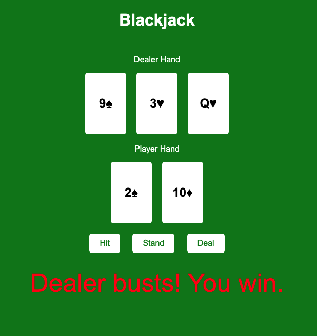

# Blackjack Game

Welcome to the Blackjack Game repository! This project is a classic casino card game implemented using HTML, CSS, and JavaScript.



## Table of Contents

- [Introduction](#Introduction)
- [Technologies Used](#Technologies-Used)
- [Features](#Features)
- [Installation](#Installation)
- [Usage](#Usage)
- [Contributing](#Contribution)

## Introduction

Blackjack, also known as twenty-one, is a popular casino banking game. The goal of the game is to beat the dealer by getting a hand value that is closer to 21 than the dealer's hand, without going over 21. This repository contains the code for a web-based Blackjack game that allows users to play against a virtual dealer.

## Technologies Used


<!-- 


 -->

## Features

- Interactive User Interface: The game features a clean and intuitive user interface, allowing players to easily interact with the game.
- Realistic Gameplay: The game follows the standard rules of Blackjack, providing an authentic gaming experience.
- Responsive Design: The game is designed to be responsive, ensuring a seamless experience across different devices and screen sizes.
- Score Tracking: The game keeps track of the player's score, allowing them to monitor their progress.
- Dealer Algorithm: The dealer's actions are governed by a simple Dealer algorithm, providing a challenging opponent for the player.

## Installation

To run the Blackjack game locally, follow these steps:

1. Clone the repository:

```html
git clone https://github.com/your-username/blackjack-game.git
```

2. Navigate to the project directory:

```html
cd blackjack-game
```

3. Open the index.html file in your preferred web browser.

## Usage

Once the game is loaded, you can start playing Blackjack by following these steps:

1. Click the "Deal" button to receive your initial cards.

2. Choose to "Hit" to receive another card, "Stand" to keep your current hand.

3. The dealer will then play their hand according to the game rules.

4. The winner is determined based on the final hand values, and your score is updated accordingly.

5. You can continue playing by clicking the "Deal" button to start a new round.

## Contributing

We welcome contributions to the Blackjack Game project. If you would like to contribute, please follow these steps:

1. Fork the repository.

2. Create a new branch for your feature or bug fix.

3. Make your changes and commit them.

4. Push your changes to your forked repository.

5. Submit a pull request to the main repository.
